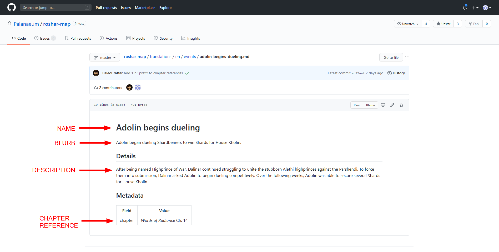
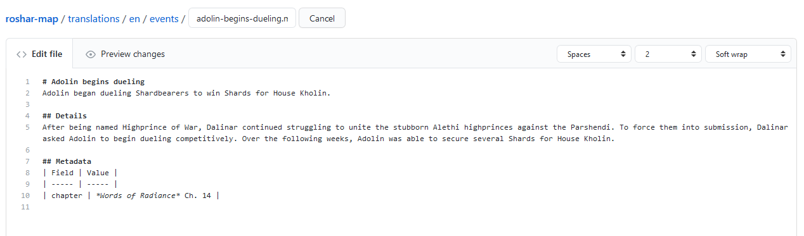
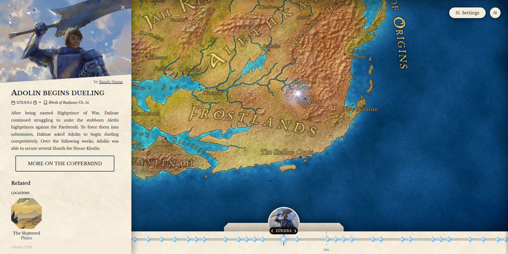
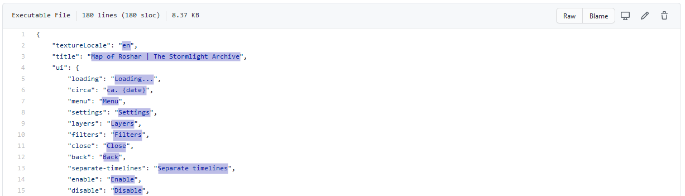

# Timeline and Events

The timeline for this project is based on Jofwu's [Stormlight Archive Timeline](https://docs.google.com/spreadsheets/d/1zq5bJoKE83ggDCjH43i1hZi0CIpB2iAx7v37zQPVFK0/edit#gid=856252766). Every event is based on book references and assumptions that are laid out in that spreadsheet. If you feel that you have found an error on the timeline, or if you would like to assist in future development of that project, please contat Jofwu on [17th Shard](https://www.17thshard.com/forum/profile/18320-jofwu/) or [Reddit](https://www.reddit.com/user/jofwu).

Before adding new events to the timeline please get persmission from our team. We may have reasons for not including the event, and if we *do* want to proceed we will need to coordinate the update with other translations.

You can help us out by (1) noting a name for the event, (2) confirming the date fo the event on Jofwu's timeline, (3) writing a small blurb for what the event is, (4) writing a larger description about the event, (5) noting any relate characters, events, or locations, and (6) recording any chapters in the books where the event occurs.
 
# Artwork

We would love to attach artwork to every event, location, and character! 

## To Artists

If you are an artist and you want to contribute to this project, we are **VERY** honored and grateful! We have a spreadsheet to keep track events and locations which currently have no artwork, [located here](https://docs.google.com/spreadsheets/d/1TkHtndfXs5-E8UL8Bf4pjuHM0PnxSvmV25u8L5veUM0/edit#gid=0). We have tried to identify which items are of particularly high (or low) importance, in our opinions. We have also made some notes on ideas of what we might see in a piece of artwork for each item. That said, we are grateful for ANY artwork you can provice, and the notes column is only there as a helpful prompt. You are more than welcome to present us with an alternate concept. We can't promise that everyone who sends us artwork will see their piece used on the map, but we will certainly take all recommendations under consideration!

## Recommendations

If you are aware of a piece of artwork that would fill in where we currently have no art, please let us know! Note that we will be looking for a good source for the artwork, and we require permission from the artist before making use of their work. We would prefer *not* to be notified of recommendations to *replace* one piece of existing artwork with another, unless you feel the quality of the current piece is significantly lacking. We are much more interested in adding artwork where none currently exists than we are in making changes to things that already have artwork. 

## Adding Artwork

Before adding artwork, please provide our team with proof that the artist gives their explicit permission to use the artwork on this site. Also make sure that you have a link to the artist's website of their choosing for crediting them.

After the artist's permission has been shared and the requisite information gathered, you can add the image file under the appropriate folder under [public/img](https://github.com/Palanaeum/roshar-map/tree/master/public/img). Next navigate to [src/store](https://github.com/Palanaeum/roshar-map/tree/master/src/store) and open the appropriate .json file for the item you wish to add artwork for. For example, to add artwork for an event, open `events.json`. Find the exact item you are adding artwork to and create a new `"image"` key. It will require both a `"file"` (the location ane name of the file in the img directory) and a `"credits"` (providing the name of the artist and a link to their website). See other uses of artwork in the .json file for examples.

# Translation

This is guide will walk through the process of preparing the files necessary for a new translation of the Interactive Map of Roshar.

### Translating Markdown Files

Most of the site's text is found in the markdown files located under the [translations](https://github.com/Palanaeum/roshar-map/tree/master/translations) directory. You will want to download the English files in the `en` folder, rename the `en` folder to the appropriate language code, and then translate the contents of the files as described below. You **should not** translate the names of the files themselves. The files are organized into four subfolders: Characters, Events, Locations, and Misc.

Here's an example of a markdown file from the Events folder, both a preview of the file and inside the file editor:





Event files have a Name, Blurb, Description, and sometimes a Chapter Reference. Each of these will need to be translated. The Name should be a level one header (preceded by a `# `). The Blurb is the text that immediate follows the Name, and is a *brief* description of the event. The Name and Blurb appear when you select an event on the timeline on the Interactive Roshar Map:


The Description is a longer description of the event, which appears in the left panel when users click for more information. The Chapter Reference will appear at the top of this panel, if the event refers to an event which happens in the books:



The Character, Location, and Misc markdown files are a simpler case of the same thing. They simply have a Name (as a level one header) and a Description (text following the Name).

Here is a brief guide on using the markdown for different formatting: https://guides.github.com/features/mastering-markdown/. Also note that you can create links to other items on the site (other Events, Characters, Locations, Misc items) in the text using `#[TEXT](folder/filename)` where `TEXT` is the text that will appear on the site, `folder` is the folder that the item can be found in (Locations, Events, etc.) and `filename` is the name of the item's file (excluding the .md file extension).

Translator's notes may be added in two ways, exemplified by the following Markdown snippet:
````markdown
<!-- Will be rendered in parentheses inline with the rest of the text -->
This is normal text _[tn](This is a translator's note)_. Normal text continues here.

<!-- Will be rendered as an individual section, can contain paragraphs --> 
```tn
Translator's note goes here
```
````

You can edit these markdown files directly in GitHub OR you can download the files to your computer, edit them in a text editing program like Notepad++, and upload them all at once.

### Translating UI Elements

Most of the site's user interface elements can be translated in the appropriate .json file under [/src/lang](https://github.com/Palanaeum/roshar-map/tree/master/src/lang). You can copy `en.json` as a reference and translate the terms that appear on the *right* side of the colons, inside parenthesis. Or if you're uncomfortable editing the .json file directly, try using https://comigo.itch.io/jsonbabel.

For example, all of the blue-highlighted text here will need to be translated:



The next step is to deal with the translation of the map itself. This will require editing several image files. Take special note of the very first item in the .json file: `"textureLocale": "en",`. This line tells the site which language's image files to use. In this case, the "en" tells the site to use the English files located in the "/en" subdirectory here: [roshar-map/src/assets/textures/localized](https://github.com/Palanaeum/roshar-map/tree/master/src/assets/textures/localized) We will need to create a new directory for the correct language code here, and put all of the new image files there.

Finally, selection boundaries for the text on the map need to be updated. It is best to approach one of the maintainers of this repo (e.g. @PaleoCrafter, Paleo#1001 on Discord) about these last two steps since they require very specific outputs.

### Questions?

If you have any questions, just ask! We hope this guide will help, but we expect that you will have questions along the way.
