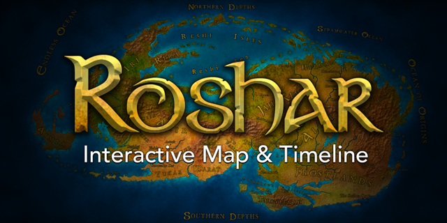

  

  
  
  
  

> She trailed off, noticing for the first time that a map covered the table nearby. Expansive, it showed a land bounded by oceans—and the artistry of it put her own attempts to shame.
> 
> — Prologue to <em>Oathbringer</em>

  An interactive map of Roshar, the world that <em>The Stormlight Archive</em>, a series of epic fantasy books by <a href="https://brandonsanderson.com">Brandon Sanderson</a>, takes place on. There are descriptions of every location as well as a navigable timeline of events. Built using <a href="https://vuejs.org/">Vue.js</a> and <a href="https://threejs.org/">three.js</a>.

## Features

 * Fully labeled, explorable map of Roshar—including Shadesmar
 * Detailed timeline of the history of Roshar, spanning from pre-history to current events in the published books
 * Summaries of events, locations, and characters including links to related items and further details on the [Coppermind Wiki](https://coppermind.net)
 * Localized content, currently available in the following languages besides English:
   * Spanish
 * Layers on top of the map that can be enabled at any time, displaying useful additional information
   * Overlay the borders of the historic Silver Kingdoms
   * Show color indicators of the allegiances of various nations
   * Map out the ten Oathgate locations
 * Powerful filtering and customization capabilities
   * Filter timeline events by tags
   * Display a timeline separately from the rest to identify a single character's or book's events
   * Lock navigation controls to a separate timeline to follow only its events

## Contribute

Help is always welcome! There's two main ways of contributing directly to this project: Translations and code. For translations, you may contribute both fixes to existing texts—including English—as well as entirely new locales. Feel free to work on translations in chunks and to ask for help in getting a new language set up on our [Discord](https://discord.gg/x9hjkKXBew) or forums, especially where localizing the actual map is concerned.

Bug fixes and improvements based on [reported issues](https://github.com/Palanaeum/roshar-map/issues) can be addressed through pull requests if you feel confident to work on the code base. As goes for translations, do not shy away from asking other contributors for pointers on where to start looking.

If you've found a bug or would like to request a feature, please report it on [GitHub's issue tracker](https://github.com/Palanaeum/roshar-map/issues).

For some more detailed instructions on both translating and developing, follow the [contribution guide](CONTRIBUTING.md).

## Credits

Obviously this project would not exist without the fantastic books by [Brandon Sanderson](https://brandonsanderson.com). The richness of the world allows us to create such a detailed experience.

The following is a list of all the artists that are either official artists or have gracefully granted this project permission to use their pieces as images for events, locations, characters, or other items:

 * [Adam J. Marin](https://www.adamjmarin.com)
 * [Aleah Lauren](https://www.instagram.com/prophecywine/)
 * [Alex Allen](https://coppermind.net/wiki/Coppermind:Artists/Alex_Allen)
 * [Antti Hakosaari](https://coppermind.net/wiki/Coppermind:Artists/Antti_Hakosaari)
 * [Ari Ibarra](https://coppermind.net/wiki/Coppermind:Artists/Ari_Ibarra)
 * [Artem Demura](https://coppermind.net/wiki/Coppermind:Artists/Artem_Demura)
 * [Artur Felipe Mósca](https://coppermind.net/wiki/Coppermind:Artists/Artur_Felipe_M%C3%B3sca)
 * [Art Noob](https://coppermind.net/wiki/Coppermind:Artists/Art_Noob)
 * [AshfellEverdawn](https://www.reddit.com/user/AshfellEverdawn)
 * [Ashley Coad](https://coppermind.net/wiki/Coppermind:Artists/Ashley_Coad)
 * [Audrey Hotte](https://coppermind.net/wiki/Coppermind:Artists/Audrey_Hotte)
 * [BBQShapez](https://coppermind.net/wiki/Coppermind:Artists/BBQShapez)
 * [beagifted](https://www.deviantart.com/beagifted/art/The-Way-of-Kings-Excerpt-Illustration-826870710)
 * [Ben McSweeney](https://coppermind.net/wiki/Coppermind:Artists/Ben_McSweeney)
 * [Bonnie Johnson](https://coppermind.net/wiki/Coppermind:Artists/Bonnie_Johnson)
 * [botanicaxu](https://coppermind.net/wiki/Coppermind:Artists/botanicaxu)
 * [Casey Fallon](https://coppermind.net/wiki/Coppermind:Artists/Casey_Fallon)
 * [Caio Santos](https://coppermind.net/wiki/Coppermind:Artists/Caio_Santos)
 * [Connor Chamberlain](https://www.artstation.com/conjchamberlain)
 * [Damako Art](https://coppermind.net/wiki/Coppermind:Artists/Damako_Art)
 * [Eduard Coll](https://www.artstation.com/eduardcoll)
 * [Elisgardor](https://coppermind.net/wiki/Coppermind:Artists/Elisgardor)
 * [Ellie L.](https://coppermind.net/wiki/Coppermind:Artists/Ellie_L.)
 * [Evan Monteiro](https://coppermind.net/wiki/Coppermind:Artists/Evan_Monteiro)
 * [Esther Schrader](https://coppermind.net/wiki/Coppermind:Artists/Esther_Schrader)
 * [Exmakina](https://coppermind.net/wiki/Coppermind:Artists/Exmakina)
 * [FelCandy](https://coppermind.net/wiki/Coppermind:Artists/FelCandy)
 * [Gal Or](https://coppermind.net/wiki/File:Darkeyes_by_Gal_Or.jpg)
 * [Ganna Pazyniuk ](https://coppermind.net/wiki/Coppermind:Artists/AnnDR)
 * [Grant M. Hansen](https://coppermind.net/wiki/Coppermind:Artists/Grant_M._Hansen)
 * [Howard Lyon](https://coppermind.net/wiki/Howard_Lyon)
 * [Isaac Stewart](https://coppermind.net/wiki/Isaac_Stewart)
 * [Jacobo Montoya](https://coppermind.net/wiki/Coppermind:Artists/Jacobo_Montoya)
 * [Jordi Rapture](https://coppermind.net/wiki/Coppermind:Artists/Jordi_Rapture)
 * [Jules Aguimatang](https://coppermind.net/wiki/Coppermind:Artists/Jules_Aguimatang)
 * [Krystian Biskup](https://imgur.com/gallery/Bw2k31X)
 * [Kyle Pearson](https://coppermind.net/wiki/Coppermind:Artists/Kyle_Pearson)
 * [LittleGreyDragon](https://coppermind.net/wiki/Coppermind:Artists/LittleGreyDragon)
 * [Marie Seeberger](https://coppermind.net/wiki/Coppermind:Artists/Marie_Seeberger)
 * [Michael Whelan](https://coppermind.net/wiki/Michael_Whelan)
 * [Neirr](https://coppermind.net/wiki/Coppermind:Artists/Neirr)
 * [Nick Vidic](https://coppermind.net/wiki/Coppermind:Artists/Nick_Vidic)
 * [Otto Didact](https://coppermind.net/wiki/User:Otto_didact)
 * [Petar Penev](https://coppermind.net/wiki/Coppermind:Artists/Petar_Penev)
 * [Randy Vargas](https://coppermind.net/wiki/Coppermind:Artists/Randy_Vargas)
 * [Rebecca Sorge](https://coppermind.net/wiki/Coppermind:Artists/Rebecca_Sorge)
 * [Sheep](https://coppermind.net/wiki/Coppermind:Artists/Sheep)
 * [Shuravf](https://coppermind.net/wiki/Coppermind:Artists/Shuravf)
 * [Soph Peralta](https://coppermind.net/wiki/Coppermind:Artists/Soph_Peralta)
 * [Tara Spruit](https://coppermind.net/wiki/Coppermind:Artists/taratjah)
 * [ThomasW](https://coppermind.net/wiki/Coppermind:Artists/ThomasW)
 * [Vladora](https://coppermind.net/wiki/Coppermind:Artists/Vladora)
 * [Xabi Gazte](https://coppermind.net/wiki/Coppermind:Artists/Xabi_Gazte)
 * [Yen Shu Liao](https://coppermind.net/wiki/Coppermind:Artists/Yen_Shu_Liao)
 * [Zamoraalma](https://www.artstation.com/Zamoraalma)

A very special thanks goes out to Reddit user [Stoneward13](https://www.reddit.com/user/Stoneward13) for letting use and modify his awesome high resolution versions of the Roshar and Shadesmar maps.

We also thank the amazing people at [cosmere.es](https://cosmere.es/) and everyone else in our translation Discord server for going through the monumental effort of translating everything to several other languages, and fixing errors in the English text along the way!

Finally, the general appearance and concept of the map derives heavily from the [interactive map](http://witchernetflix.com/) of "The Continent" for Netflix's *The Witcher* series.

## License

This project is licensed under the [MIT License](LICENSE). Please familiarize yourself with it if you wish to contribute.

**⚠️ Note**: This license only applies to the *code itself*. All the artwork used for the map is used and distributed with special permission for the 17th Shard. Furthermore, the names and ideas from *The Stormlight Archive* are reproduced here in conformance with [Brandon Sanderson's fanart policy](https://faq.brandonsanderson.com/knowledge-base/can-i-make-fan-art-or-write-fan-fiction/). See the [credits section](#credits) for further details.
